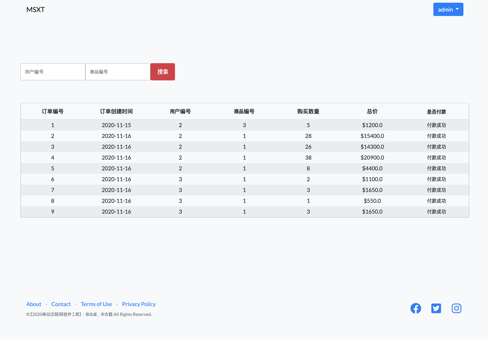
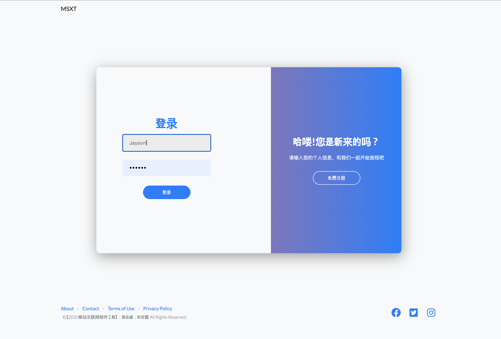
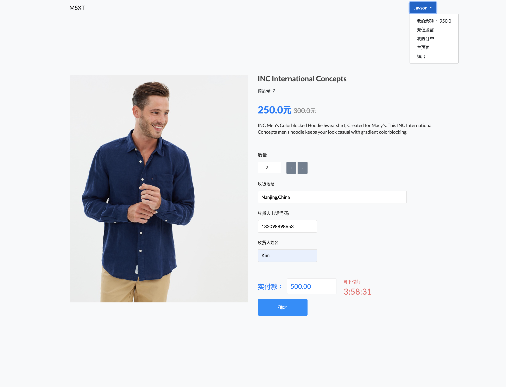
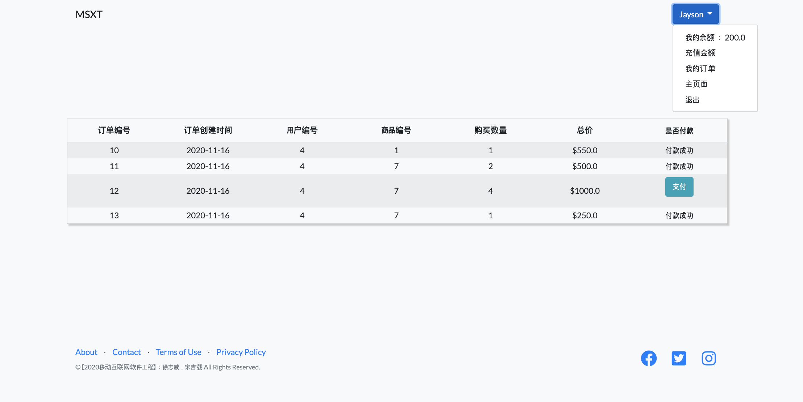
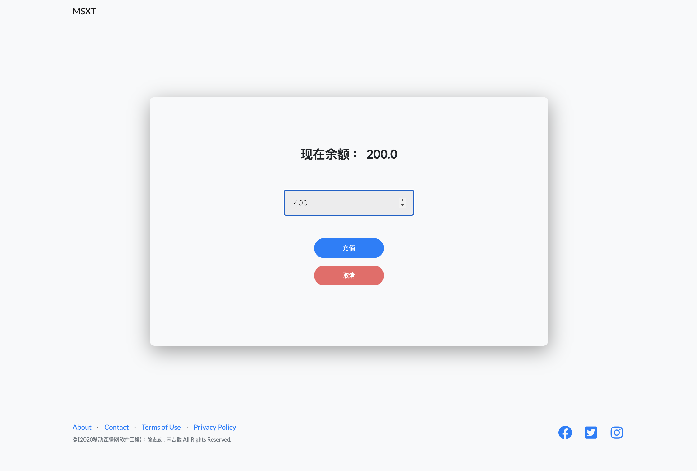

## 电商秒杀系统 (Second Kill System)

### 主页面

##### 

### 考虑点

1. 减库存问题 ：

   判断是否该产品秒杀活动中 ➡️ 判断该产品的存库量 ➡️ 生成订单 ➡️ 判断客户余额足够 ➡️ 再判断该产品的存库量 ➡️ 支付，订单成功

   

2. 为了避免用户直接访问下单⻚面URL，需要将改URL动态化，即使秒杀系统 的开发者也无法在秒杀开始前访问下单⻚面的URL。

   （由服务器端ProductService层insertProduct方法生成的随机数作为参数，在秒杀开始的时候才能得到）

### 功能点

**👨‍💻 *【管理者】* ：产品管理，整个订单管理(=查询)，不能购买产品**

**🤑 *【客户】*：登录/注册，秒杀产品创建订单(=购买)，余额充值，订单历史(+订单支付)**

#### 怎么🏃‍♂️🏃‍♀️？ *(실행방법)*：

[1] applicationContext.xml里改本地数据库密码 *(applicationContext.xml에 local DB에 맞게로 수정하고)*

[2] 运行mysql query (exampled.sql) *(exampled.sql local DB에 먼저 실행해서 DB 생성한 다음)*

[3] 点击jetty:run *(jetty:run 누르면)*

[4] url : http://localhost:8088/msxt/

[5] Enjoy *(끄읕ㅎ)*

