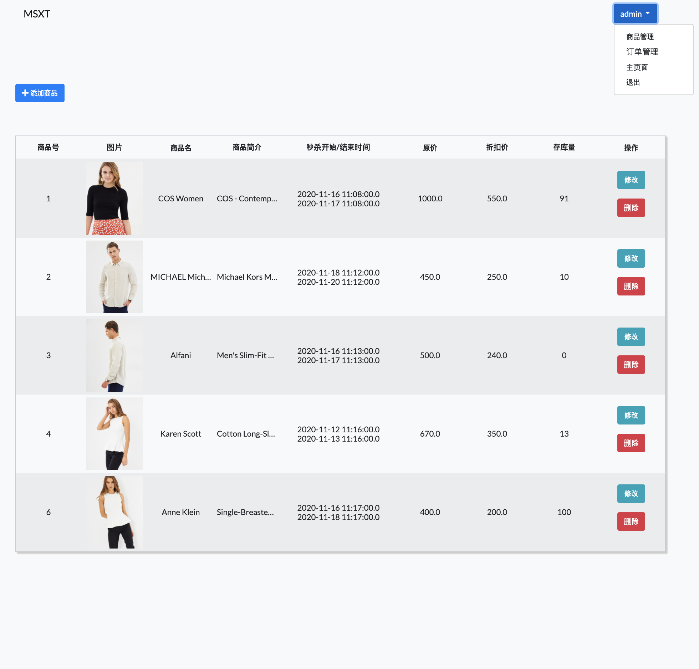

## 电商秒杀系统 (Second Kill System)

### 《主页面》

### 《考虑点》

1. 减库存问题 ：

   判断是否该产品秒杀活动中 ➡️ 判断该产品的存库量 ➡️ 生成订单 ➡️ 判断客户余额足够 ➡️ 再判断该产品的存库量 ➡️ 支付，订单成功

   

2. 为了避免用户直接访问下单⻚面URL，需要将改URL动态化，即使秒杀系统 的开发者也无法在秒杀开始前访问下单⻚面的URL。

   （由服务器端ProductService层insertProduct方法生成的随机数作为参数，在秒杀开始的时候才能得到）

### 《功能点》

**👨‍💻 *【管理者】* ：产品管理，整个订单管理(=查询)，不能购买产品**

**🤑 *【客户】*：登录/注册，秒杀产品创建订单(=购买)，余额充值，订单历史(+订单支付)**

#### 《怎么🏃‍♂️🏃‍♀️？》：

[1] applicationContext.xml里改本地数据库密码 *(applicationContext.xml에 local DB에 맞게로 수정)*

[2] 运行mysql query (exampled.sql) *(exampled.sql local DB에 먼저 실행해서 DB 생성)*

[3] 点击jetty:run

[4] url : http://localhost:8088/msxt/

---------------------------------------
#### 秒杀系统参考 ：
https://blog.csdn.net/u014231523/category_8109361.html

#### ps.아쉬웠던 점:
사용자가 직접 Main page를 다시 reload를 하지않아도 현재 [구매 불가능] 버튼이 second kill sale 시간이 딱 되면 바로 [구매하기] 버튼으로 스스로 변할 수 있게 
대략 5초 간격으로 javascript를 지속적으로 reload해주는 server가 있어야되는데 구현하지 못했다.

그냥 Main page에다 setTimeout("location.reload()",5000)를 적용해볼까도 생각해봤지만
매번 reload될때 마다 Main page상단으로 계속 올라가게되 지속적으로 scroll down하면서 웹페이지를 보는데 방해가 될꺼같아 적용하지 않았다.

